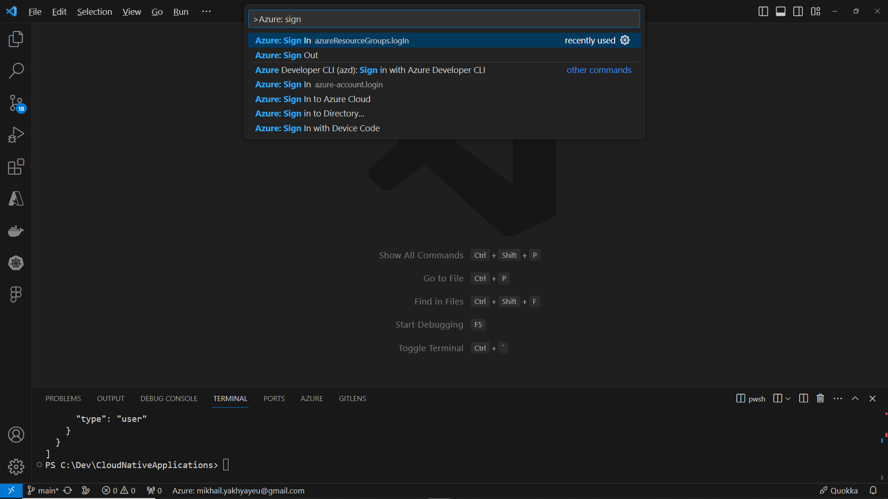
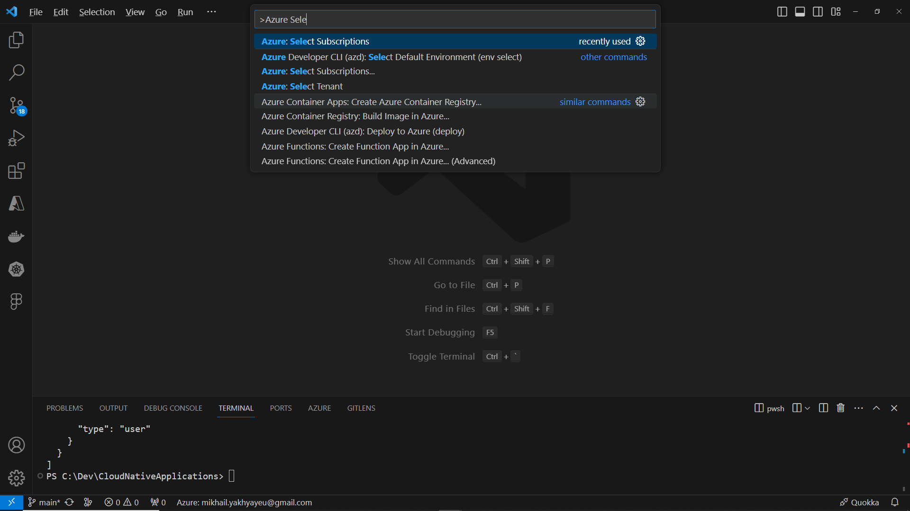
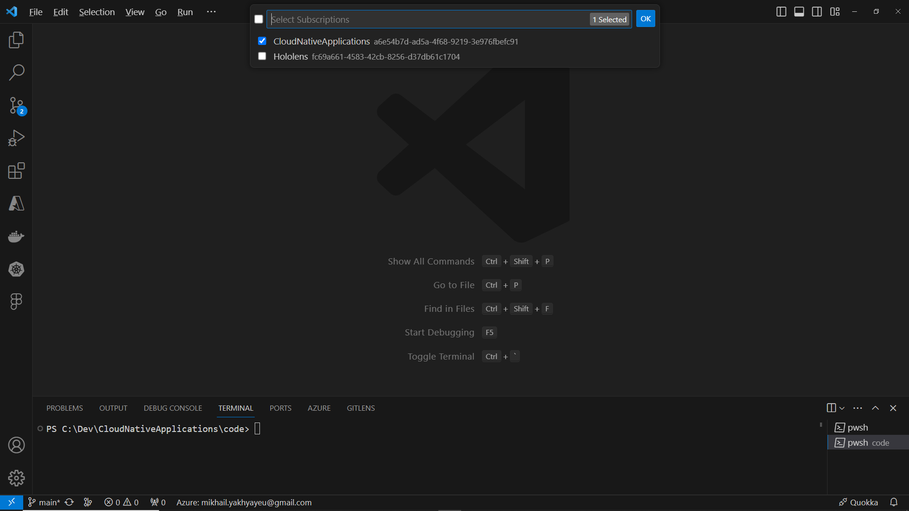

# Cloud Native Applications

[Previous step](../../README.md) - [Next step](../step-02/README.md)

## Step 1 - Connect Visual Studio Code to your Azure Subscription

### Login to the Azure CLI

In Visual Studio Code, open a terminal and run az login to sign into Azure (requires an active subscription):

```
az login
```

If you have multiple subscriptions with your Azure account get a list all your subscriptions:

```
az account list -o table
```

Find the correct SubscriptionId and activate it:

```
az account set -s <SubscriptionId>
```

### Login to Azure in Visual Studio Code

In Visual Studio, press Ctrl+Shift+P to open the Command Palette and search for "Azure: Sign In" to link your account:



Log in through the opened browser with your Microsoft account linked to Azure, completing all authentication steps to gain access.

In Visual Studio Code, use the Command Palette to select your active subscriptions, marking your choices with checkboxes:







[Previous step](../../README.md) - [Next step](../step-02/README.md)