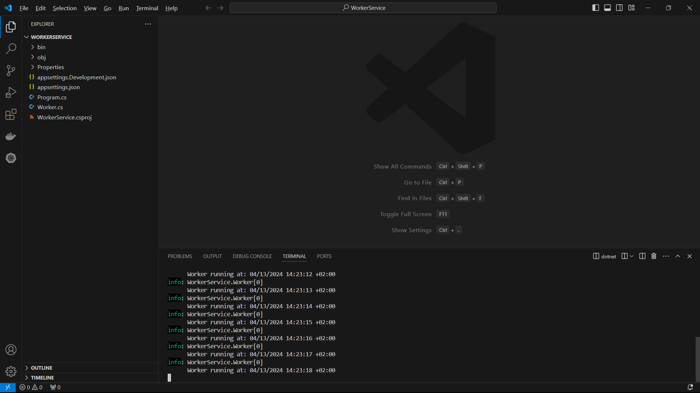
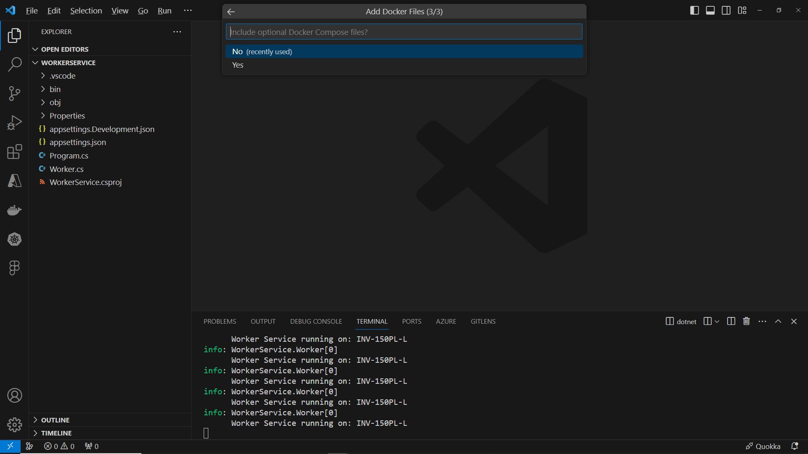

# Cloud Native Applications

[Previous step](../step-01/README.md) - [Next step](../step-03/README.md)

## Step 2 - Containerize a .NET Core Worker Service

1. Run `dotnet new worker -n WorkerService` in the terminal to create the .net worker project:


2. Open project folder in VS Code and run it:



3. Stop the worker.

4. Modify the Worker.cs file with a minor code change:

```csharp
protected override async Task ExecuteAsync(CancellationToken stoppingToken)
{
    while (!stoppingToken.IsCancellationRequested)
    {
        if (_logger.IsEnabled(LogLevel.Information))
        {
            _logger.LogInformation($"Worker Service running on: {Environment.MachineName}");
        }
        await Task.Delay(1000, stoppingToken);
    }
}
```

5. Restart the Worker Service from the console to see your machine name printed every five seconds.

6. To create a Docker container, open Visual Studio Code's Command Palette and locate the command for Docker file creation.


7. Choose .NET Core Console application for Linux without Docker Compose files.




8. Right-click the Docker file and select "Build Image" to create a Docker image.


9. Check the Docker image in VS Code's Docker sidebar:


10. Test the image by right-clicking the latest tag and selecting "Run" to see it in the containers list.


11. View container logs by right-clicking it and selecting "View Logs" to see WorkerService output in the terminal.


Stop the container to free system resources.

[Previous step](../step-01/README.md) - [Next step](../step-03/README.md)