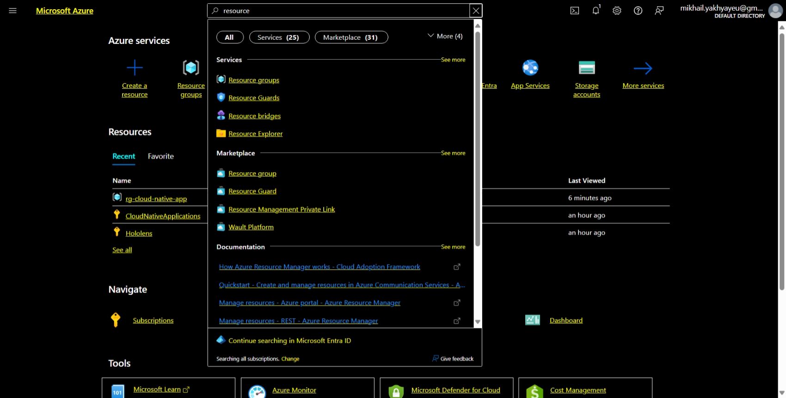
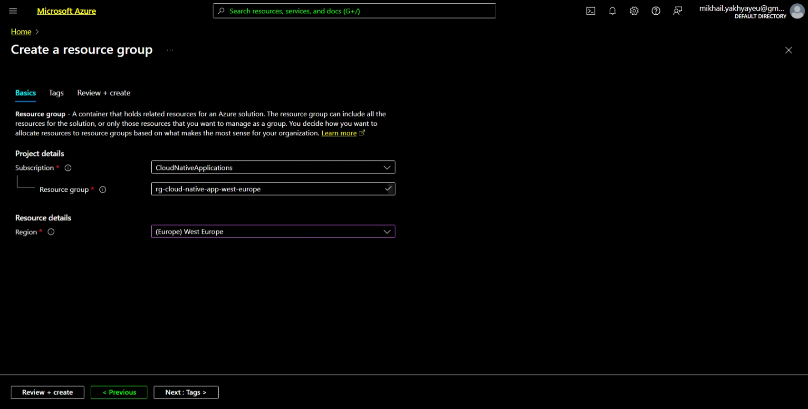

# Cloud Native Applications

[Previous step](../step-02/README.md) - [Next step](../step-04/README.md)

## Step 3 - Create an Azure resource group

Log into the Azure Portal, use the search bar or homepage to find "Resource Groups", and create a new one with your subscription account:



Create the resource group inside your selected subscription and West-Europe region:

```
rg-cloud-native-app-west-europe
```



[Previous step](../step-02/README.md) - [Next step](../step-04/README.md)