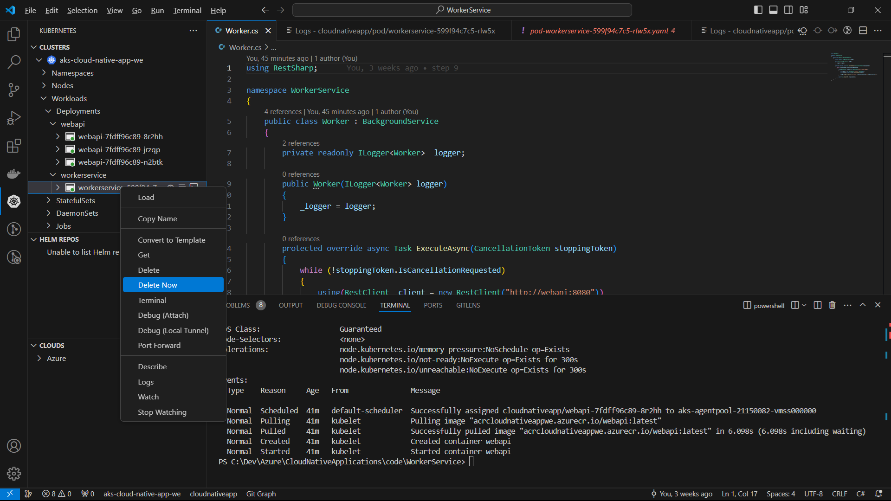

# Cloud Native Applications

[Previous step](../step-09/README.md) - [Next step](../step-10/README.md)

## Step 9 - Modify the .NET Core Worker Service to call the WebApi and fetch the machine name

1. Open the WorkerService project in Visual Studio Code and use `dotnet add package RestSharp` to add the RestSharp NuGet package:


2. Modify the Worker class to fetch the machine name from the WebApi. The Kubernetes service allows the WebApi to be accessed within the cluster using its app-name as the domain name:

```csharp
public class Worker : BackgroundService
{
    private readonly ILogger<Worker> _logger;
    private readonly RestClient _client = new RestClient("http://webapi");

    public Worker(ILogger<Worker> logger)
    {
        _logger = logger;
    }

    protected override async Task ExecuteAsync(CancellationToken stoppingToken)
    {
        while (!stoppingToken.IsCancellationRequested)
        {

            var request = new RestRequest("status", Method.Get);
            var response = await _client.ExecuteAsync(request);

            _logger.LogInformation($"RESPONSE: {response.StatusCode}, {response.Content}");

            await Task.Delay(500, stoppingToken);
        }
    }
}
```

3. Open the Dockerfile for the WorkerService project and build it by right-clicking on the file:


4. If the image builds successfully, locate it in your local Docker images and push it to your Azure Container Registry:


5. In the Visual Studio Code Kubernetes Activity pane, find your WorkerService pod and delete it. Kubernetes will automatically spin up a new instance from the Azure Container Registry due to the deployment settings that maintain one running replica:



[Previous step](../step-09/README.md) - [Next step](../step-10/README.md)