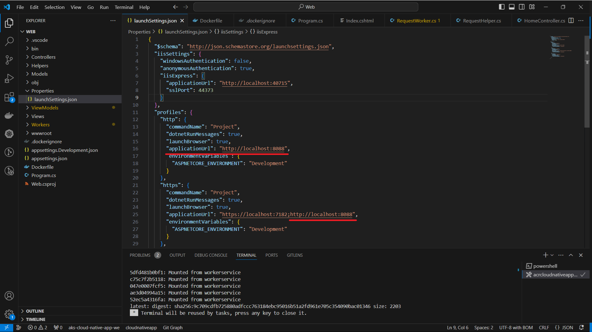
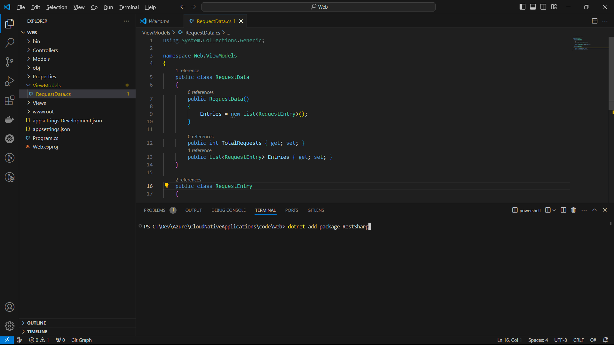
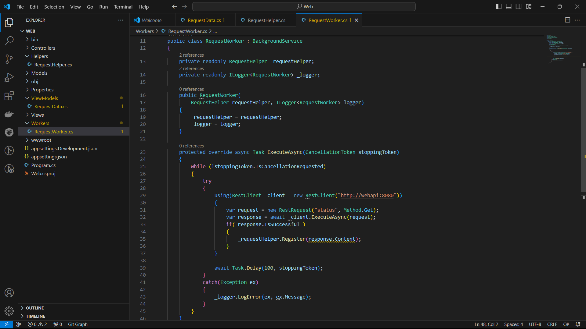
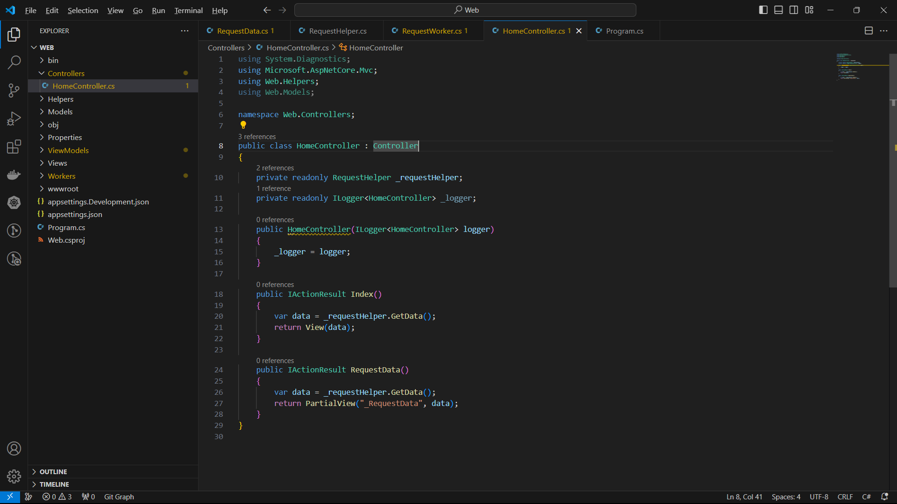
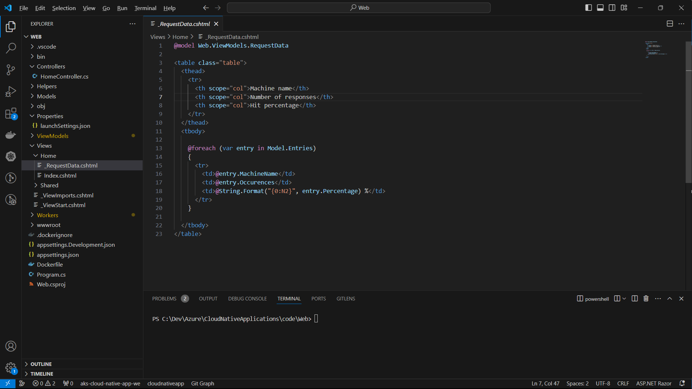
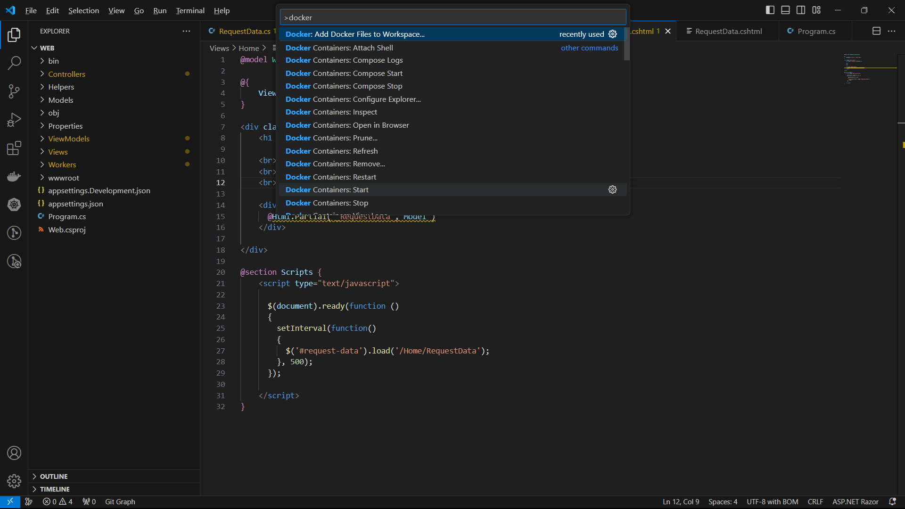
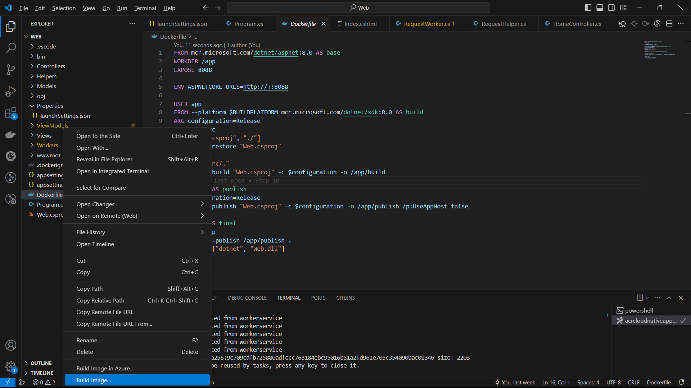

# Cloud Native Applications

[Previous step](../step-09/README.md) - [Next step](../step-11/README.md)

## Step 10 - Create an ASP.NET Blazor Server Web application and deploy it to Kubernetes

1. Move to the parent directory of the WorkerService folder, then execute `dotnet new mvc -n Web` to create an MVC project:


2. The web application should fetch and display responses from the load-balanced WebApi on a webpage. Open the mvc Web project in Visual Studio Code, add a 'ViewModels' folder, and create a C# source file inside it for the following class:

```csharp
using System.Collections.Generic;

namespace Web.ViewModels
{
    public class RequestData
    {
        public RequestData()
        {
            Entries = new List<RequestEntry>();    
        }

        public int TotalRequests { get; set; }
        public List<RequestEntry> Entries { get; set; }
    }

    public class RequestEntry
    {
        public string MachineName { get; set; }
        public int Occurences { get; set; }
        public decimal Percentage { get; set; }
    }
}
```



3. Because you need to request the data from the WebApi, add the RestSharp NuGet package to the project using the `dotnet add package RestSharp` command in Terminal:


4. Add a 'Helpers' folder and create a C# source file for the following class:

```csharp
using System.Collections.Generic;
using Web.ViewModels;

namespace Web.Helpers
{
    public class RequestHelper
    {
        private readonly Dictionary<string, int> _responses = new Dictionary<string, int>();

        public void Register(string machineName)
        {
            if(!_responses.ContainsKey(machineName))
            {
                _responses.Add(machineName, 0);
            }

            _responses[machineName]++;
        }

        public RequestData GetData()
        {
            var data = new RequestData();

            foreach(var key in _responses.Keys)
            {
                data.TotalRequests += _responses[key];
            }

            foreach(var key in _responses.Keys)
            {
                data.Entries.Add(new RequestEntry
                {
                    MachineName = key,
                    Occurences = _responses[key],
                    Percentage = (decimal)_responses[key] / (decimal)data.TotalRequests * 100.0M
                });
            }

            return data;
        }
    }
}
```
This class stores all WebApi responses in memory and converts them into a dataset for webpage display.



5. Add a Worker Service to your ASP.NET Core MVC project to make repeated calls to the WebApi. Inside a new 'Workers' folder, create a C# source file containing the specified class:

```csharp
using System;
using System.Threading;
using System.Threading.Tasks;
using Microsoft.Extensions.Hosting;
using Microsoft.Extensions.Logging;
using RestSharp;
using Web.Helpers;

namespace Web.Workers
{
    public class RequestWorker : BackgroundService
    {
        private readonly RequestHelper _requestHelper;
        private readonly ILogger<RequestWorker> _logger;

        public RequestWorker(
            RequestHelper requestHelper, ILogger<RequestWorker> logger)
        {
            _requestHelper = requestHelper;
            _logger = logger;
        }

        protected override async Task ExecuteAsync(CancellationToken stoppingToken)
        {
            while (!stoppingToken.IsCancellationRequested)
            {
                try
                {
                    using(RestClient _client = new RestClient("http://webapi:8080"))
                    {
                        var request = new RestRequest("status", Method.Get);
                        var response = await _client.ExecuteAsync(request);
                        if( response.IsSuccessful )
                        {
                            _requestHelper.Register(response.Content);
                        }
                    }
                    
                    await Task.Delay(100, stoppingToken);
                }
                catch(Exception ex)
                {
                    _logger.LogError(ex, ex.Message);
                }
            }
        }
    }
}
```

The background worker will execute every 100 milliseconds to retrieve responses from the WebApi.


6. Register these classes in the dependency injection container to integrate all components:

```csharp
builder.Services.AddSingleton<RequestHelper>();
builder.Services.AddHostedService<RequestWorker>();
```

7. Modify the HomeController to include only a Get method that calls the RequestHelper:

```csharp
using Microsoft.AspNetCore.Mvc;
using Microsoft.Extensions.Logging;
using Web.Helpers;

namespace Web.Controllers
{
    public class HomeController : Controller
    {
        private readonly RequestHelper _requestHelper;
        private readonly ILogger<HomeController> _logger;

        public HomeController(
          RequestHelper requestHelper,
          ILogger<HomeController> logger)
        {
            _requestHelper = requestHelper;
            _logger = logger;
        }

        public IActionResult Index()
        {
            var data = _requestHelper.GetData();
            return View(data);
        }

        public IActionResult RequestData()
        {
            var data = _requestHelper.GetData();
            return PartialView("_RequestData", data);
        }
    }
}
```



8. Update the views to display the data accordingly:

**~/Views/Home/Index.cshtml**

```csharp
@model Web.ViewModels.RequestData

@{
    ViewData["Title"] = "Home Page";
}

<div class="text-center">
    <h1 class="display-4">Welcome</h1>
    
    <br>
    <br>
    <br>

    <div id="request-data">
      @Html.Partial("_RequestData", Model )
    </div>   

</div>

@section Scripts {
    <script type="text/javascript">
      
      $(document).ready(function () 
      {
        setInterval(function()
        { 
          $('#request-data').load('/Home/RequestData');
        }, 500);        
      });

    </script>
}
```

**~/Views/Home/RequestData.cshtml**

```csharp
@model Web.ViewModels.RequestData

<table class="table">
  <thead>
    <tr>
      <th scope="col">Machine name</th>
      <th scope="col">Number of responses</th>
      <th scope="col">Hit percentage</th>
    </tr>
  </thead>
  <tbody>
    
    @foreach (var entry in Model.Entries)
    {
      <tr>
        <td>@entry.MachineName</td>
        <td>@entry.Occurences</td>
        <td>@String.Format("{0:N2}", entry.Percentage) %</td>
      </tr>      
    }

  </tbody>
</table>
```



9. Use the command palette to create a Dockerfile for an ASP.NET Core application on Linux:



10. Build the Dockerfile and push the image to your Azure Container Registry:





11. Create two new YAML files for deploying your web application: one for the deployment and another for the service exposing it to the Kubernetes internal HTTP network. Apply these YAML files using the command palette:

**deployment-web.yml**

```csharp
apiVersion: apps/v1
kind: Deployment
metadata:
  name: web
spec:
  replicas: 1
  selector:
    matchLabels:
      app: web
  template:
    metadata:
      labels:
        app: web
    spec:
      containers:
      - name: web
        image: acrcloudnativeappwe.azurecr.io/web:latest
        resources:
          limits:
            memory: "128Mi"
            cpu: "500m"
        ports:
        - containerPort: 80
```

**service-web.yml**

```csharp
apiVersion: v1
kind: Service
metadata:
  name: web
spec:
  selector:
    app: web
  ports:
  - port: 80
    targetPort: 80
```

12. Check the Kubernetes cluster. You should see a web deployment with 1 pod, a webapi deployment with 3 pods, and a workerservice deployment with 1 pod running:


[Previous step](../step-09/README.md) - [Next step](../step-11/README.md)