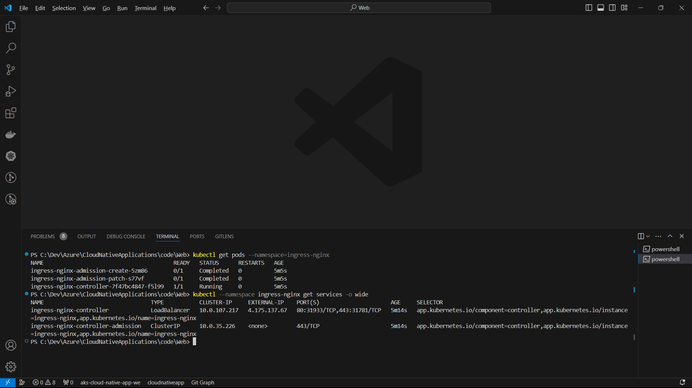
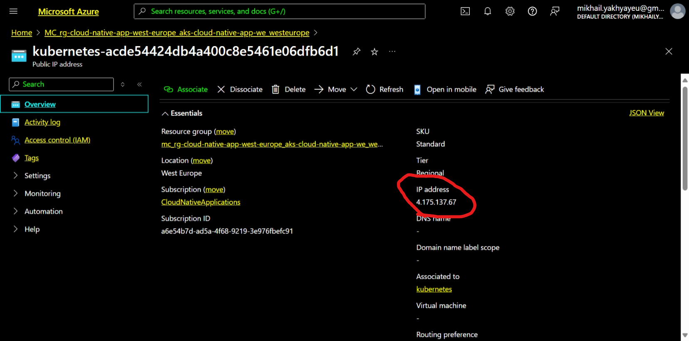
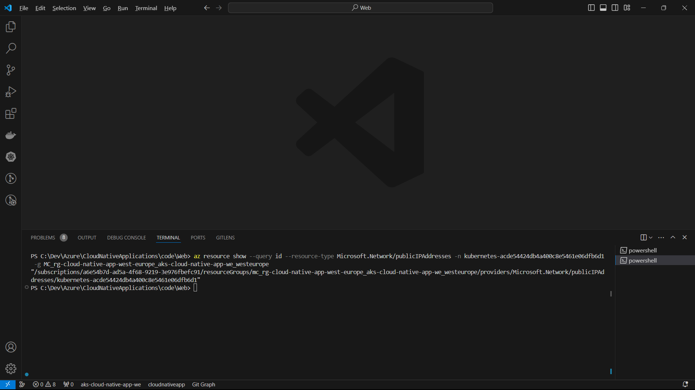

# Cloud Native Applications

[Previous step](../step-11/README.md)

## Step 12 - Adding an NGINX ingress controller

With knowledge of the resource group holding AKS networking resources, proceed to install the NGINX ingress extension on your Kubernetes cluster.

1. Installing the NGINX ingress extension can be performed manually, but you can also use a predefined deploy script.

[Find more information about deploying the NGINX ingress extension](https://kubernetes.github.io/ingress-nginx/deploy/)

```
kubectl apply -f https://raw.githubusercontent.com/kubernetes/ingress-nginx/controller-v1.4.0/deploy/static/provider/cloud/deploy.yaml
```

The script created a new namespace and deployed the necessary resources within it.


2. Run the commands below to check if all pods are ready and to find the EXTERNAL-IP of the ingress load balancer:

```
kubectl get pods --namespace=ingress-nginx
```

```
kubectl --namespace ingress-nginx get services -o wide
```



3. Checking the resource group with our AKS networking resources reveals a new PublicIP resource matching the IP address of our ingress load balancer:



4. Register a custom DNS name for this IP address using the commands below:

```
az resource show --query id --resource-type Microsoft.Network/publicIPAddresses -n <public-ip resource name> -g <your kubernetes networking resource group>
```

```
az resource show --query id --resource-type Microsoft.Network/publicIPAddresses -n aks-cloud-native-app-we-public-ip -g MC_rg-cloud-native-app-west-europe_aks-cloud-native-app-we_westeurope
```



5. Copy the response from the previous script for use in the next script:

```
az network public-ip update --ids "<copied-response>" --dns-name <dns-name>
```

```
az network public-ip update --ids "/subscriptions/a6e54b7d-ad5a-4f68-9219-3e976fbefc91/resourceGroups/mc_rg-cloud-native-app-west-europe_aks-cloud-native-app-we_westeurope/providers/Microsoft.Network/publicIPAddresses/kubernetes-public-ip" --dns-name cloud-native-applications
```

6. Visit your custom DNS to verify if the NGINX ingress controller is operational. A 404 NOT FOUND response indicates it's working correctly!


7. Set your custom Kubernetes namespace as the default and deploy a new ingress controller to route traffic from the NGINX load balancer to your internal services:

```yaml
apiVersion: networking.k8s.io/v1
kind: Ingress
metadata:
  name: web-ingress
  annotations:
    nginx.ingress.kubernetes.io/rewrite-target: /$1
spec:
  ingressClassName: nginx
  rules:
  - host: cloud-native-applications.westeurope.cloudapp.azure.com
    http:
      paths:
      - path: /(.*)
        pathType: Prefix
        backend:
          service:
            name: web
            port:
              number: 80
```

[Previous step](../step-11/README.md)